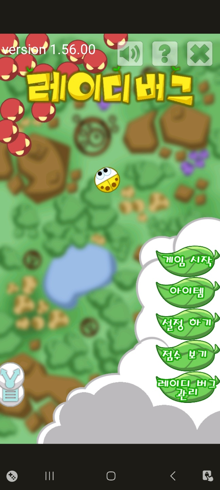
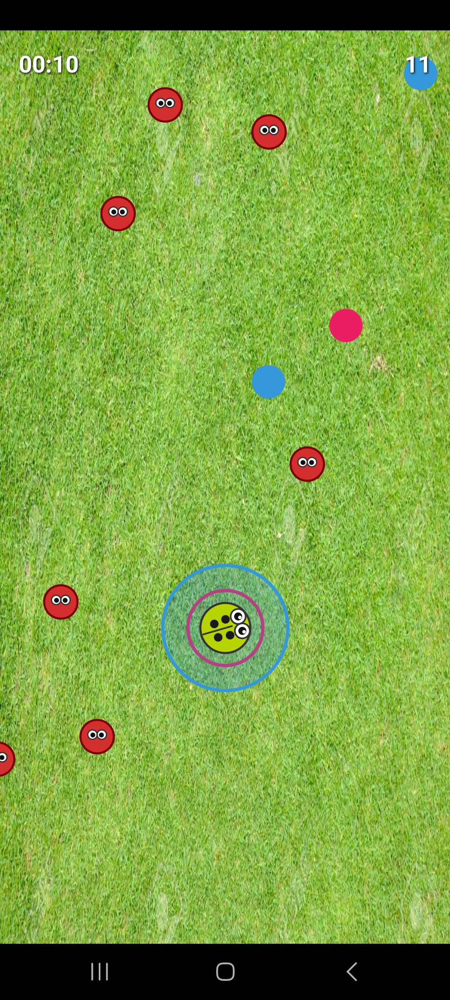

# 🐞 LadyBug

> 생존형 캐주얼 모바일 게임 — Android (Kotlin)

---

## 게임 소개

2011년 유명했던 **"레이디버그"** 슈팅 게임을 모티브로 한 생존형 캐주얼 게임입니다.  
화면 위에서 쏟아지는 적 개체를 터치로 피하며 최대한 오래 생존하는 것이 목표입니다.

### 기존 레이디버그와의 차이점

| 항목 | 기존 레이디버그 | LadyBug (본 프로젝트) |
|------|--------------|----------------------|
| 조작 방식 | 기기 기울기 | 터치 드래그 |
| 플레이어 | 고정 방향 | 터치 방향으로 실시간 회전 |
| 적 이동 | 직선 낙하 | 좌우 이동 + 시간 경과에 따른 스폰 가속 |
| 아이템 효과 | 다양한 효과 | 5종 아이템 (SHIELD·JANGPAN·SLOW·LIFE·SCORE) |
| 점수 | 생존 시간 | 생존 시간 + 적 처치 + 배율 시스템 |
| 오디오 | 있음 | BGM + 처치 효과음, 설정 탭 연동 |

### 스크린샷

| 메뉴 화면 | 인게임 |
|----------|--------|
|  |  |

---

## 개발 계획 / 일정 / 실제 진행

### 항목별 계획 대비 진행 현황

| 기능 | 계획 주차 | 실제 완료 | 상태 |
|------|----------|----------|------|
| 메뉴 화면 (배경/버튼) | 1주차 | 1~3주차 | ✅ 완료 |
| 설정 화면 | 2주차 | 1~3주차 | ✅ 완료 |
| 아이템 설명 화면 | 3주차 | 1~3주차 | ✅ 완료 |
| 게임 화면 (Custom View) | 4주차 | 4주차 | ✅ 완료 |
| 플레이어 이동 (터치) | 4주차 | 4주차 | ✅ 완료 |
| 적 스폰 / 낙하 | 5주차 | 5주차 | ✅ 완료 |
| 게임오버 판정 | 5주차 | 5주차 | ✅ 완료 |
| 아이템 5종 외형 | 6주차 | 6주차 | ✅ 완료 |
| 아이템 효과 (SHIELD·JANGPAN) | 6주차 | 6주차 | ✅ 완료 |
| 아이템 효과 (SLOW·LIFE·SCORE) | 7주차 | 7주차 | ✅ 완료 |
| 점수 시스템 | 7주차 | 7~8주차 | ✅ 완료 |
| 난이도 가중 (시간 기반) | 7주차 | 7주차 | ✅ 완료 |
| 플레이어·적 디자인 | 8주차 | 8주차 | ✅ 완료 |
| BGM / 효과음 | 8주차 | 8주차 | ✅ 완료 |
| 설정 탭 볼륨 연동 | 8주차 | 8주차 | ✅ 완료 |
| 최고 점수 저장 | - | - | ❌ 미구현 |
| 튜토리얼 | - | - | ❌ 미구현 |

### 월별 커밋 횟수

> 출처: `git log --format="%ad" --date=format:"%Y-%m"` (본 저장소 실측, 총 40커밋)

| 월 | 커밋 수 | 주요 작업 |
|----|--------|----------|
| 2026-04 | 14 | 1차 발표 — 기획, README, 초기 설정 |
| 2026-05 | 21 | 게임 핵심 구현 (Custom View, 아이템 5종, 버그 수정, 성능 최적화) |
| 2026-06 | 5 | 디자인, 점수 시스템, BGM/SFX |
| **합계** | **40** | |

```
4월 ██████████████          14
5월 █████████████████████   21
6월 █████                    5
```

---

## 사용된 기술

| 분류 | 기술 |
|------|------|
| 언어 | Kotlin |
| 플랫폼 | Android (minSdk 26 / targetSdk 36) |
| 렌더링 | Android Canvas API (`drawCircle`, `drawBitmap`, `drawText`, `rotate`) |
| 게임 루프 | `Choreographer.FrameCallback` (vsync 동기화) |
| 오디오 | `MediaPlayer` (BGM 싱글톤), `SoundPool` (효과음) |
| 데이터 저장 | `SharedPreferences` (볼륨·ON/OFF 설정값) |
| UI | `ConstraintLayout`, `AppCompatActivity`, `SwitchCompat`, `SeekBar` |
| SplashScreen | `androidx.core:core-splashscreen` (API 36 대응) |
| 빌드 | AGP 9.1.1, Gradle Kotlin DSL |

---

## 참고한 것들

- Android 공식 문서 — Canvas, SoundPool, MediaPlayer, Choreographer API 레퍼런스
- `androidx.core:core-splashscreen` — API 36 SplashScreen 버그 대응
- Kenney.nl — 효과음 에셋 (CC0 라이선스, 상업적 이용 가능)

---

## 수업 내용에서 차용한 것

### 1. Custom View + Canvas 드로잉 (4~5주차 SampleGame)
수업에서 `BallView`를 시작으로 Custom View의 `onDraw(canvas)` 오버라이드,  
`BitmapFactory.decodeResource()`, `canvas.drawCircle()`, `canvas.drawBitmap()` 등을 학습했습니다.

→ `GameView`가 동일 구조. `onDraw`에서 배경 비트맵, 적, 아이템, 플레이어를 직접 드로잉합니다.

### 2. Choreographer 게임 루프 (5주차 SampleGame/DragonFlight)
수업에서 `Choreographer.FrameCallback`으로 vsync에 동기화된 프레임 루프를 구현했습니다.

→ `GameView.frameCallback.doFrame(frameTimeNanos)` — 프레임 시간 기반 타이머(플레이 시간, 점수)에도 활용.

### 3. 원-원 충돌 감지 (6주차)
수업에서 `CollisionChecker`, `IBoxCollidable` 등 충돌 감지를 학습했습니다.

→ 박스 대신 **원-원 충돌**을 `dx²+dy² ≤ rsum²`으로 구현. `sqrt` 생략으로 성능 최적화.

### 4. canvas.rotate()로 스프라이트 방향 전환 (9주차 SmoothingPath)
수업에서 경로 방향에 따른 스프라이트 회전(`atan2` → `canvas.rotate()`)을 학습했습니다.

→ `Player.draw()`에서 `atan2(dy, dx) + 90°`로 터치 방향 계산 후 `canvas.rotate(angle, x, y)` 적용.

### 5. Activity / Intent / 생명주기 (1~2주차)
→ MainActivity → GameActivity / SettingsActivity / ItemInfoActivity 전환에 사용.

### 6. SharedPreferences (Android 기초)
→ SettingsActivity에서 BGM/SFX 볼륨·ON/OFF 설정값 저장에 사용.

---

## 직접 개발한 것

| 항목 | 내용 |
|------|------|
| 아이템 효과 시스템 | SHIELD·JANGPAN·SLOW·LIFE·SCORE 5종 독립 상태 관리 |
| 시간 기반 난이도 | `frameTimeNanos`로 경과 시간 계산, 스폰 인터벌 동적 조정 |
| 점수 시스템 | 생존 시간 + 처치 점수 + 아이템 배율 복합 계산 |
| 플레이어 디자인 | Canvas로 무당벌레 직접 드로잉 (몸통·날개선·점·눈·하이라이트) |
| 적 디자인 | Canvas로 빨간 적 직접 드로잉 (몸통·흰자·동공) |
| BGM 싱글톤 | `BgmPlayer` object — 액티비티 전환에도 재생 유지, 게임오버 시 정지 |
| SplashScreen 버그 수정 | API 36 + activity:1.13.0 충돌 원인 분석 및 `installSplashScreen()` 적용 |
| Paint 공유 최적화 | companion object로 인스턴스 공유, GC 압박 제거 |
| 배경 비트맵 최적화 | `onSizeChanged`에서 화면 크기로 사전 스케일링 |

---

## 아쉬운 것들

### 하고 싶었지만 못 한 것들
- 최고 점수 저장 및 랭킹 화면
- 적 다양화 (크기·색상·이동 패턴별 종류)
- 아이템 효과 중 남은 시간 UI 표시 (타이머 바)
- 튜토리얼 / 온보딩 화면
- 아이템 획득 시 시각적 피드백 (파티클, 화면 플래시)

### 앱 스토어 출시를 위해 보충할 것들
- 다양한 화면 비율 대응 테스트
- 앱 아이콘 및 스플래시 화면 디자인 개선
- 최고 점수 온라인 리더보드
- 접근성 지원

### 결국 해결하지 못한 문제/버그
- **콜드 스타트 검은화면**: API 36 + activity:1.13.0의 SplashScreen 충돌로 특정 상황에서 재현됨. `installSplashScreen()`으로 대부분 해결했으나 재현 조건이 불명확함.

### 기말 프로젝트를 하면서 겪은 어려움
- Android 16 (API 36) 에뮬레이터의 새로운 동작 방식으로 인한 디버깅 시간 과다 소요
- HWUI의 PNG 색 공간 인식 실패(`Unknown dataspace 0`) 문제 → BitmapFactory CPU 디코딩으로 우회
- 게임 루프와 Canvas 드로잉을 프레임워크 없이 직접 설계하는 과정의 어려움

---

## 수업에 대한 내용

### 기대한 것
Android 앱 개발의 기초와 PC와 모바일의 차별되는 기능을 활용하는 방법에 대해 배우고 싶었습니다.

### 얻은 것
- Custom View, Canvas API, Choreographer 기반 게임 루프 등 Android 게임 개발의 핵심 기법
- Activity 생명주기, SharedPreferences, Intent 등 Android 앱 구조에 대한 실질적 이해
- 기획 → 구현 → 디버깅 → 최적화로 이어지는 실제 개발 사이클 경험

### 얻지 못한 것
- 중력 센서, 빛 감지 등 데스크탑에서 느끼기 어려운 모바일 만의 특징을 살리는 개발.

### 더 좋은 수업이 되기 위한 제안
- 2d 프로그래밍 같은 코딩에 기반한 화면 구현도 재밌지만 모바일 만의 강점을 살릴수 있는 주제도 많이 접하면 좋을 것 같습니다.
 
